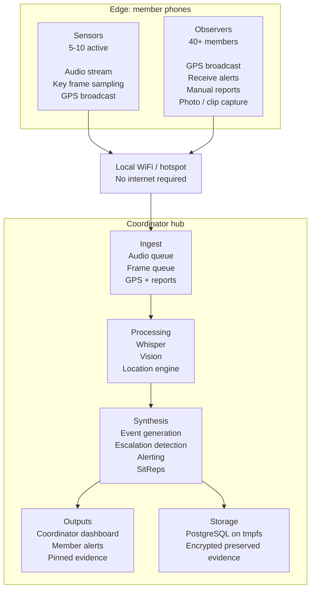

# Osk

Local-first situational awareness for civilian groups.

Osk is a design-stage project for a hub-and-spoke system that helps groups
coordinate during protests, public meetings, large events, travel, and other
situations where shared awareness matters.

> Status: Osk is currently a public design-and-foundation repository. The repo
> contains specs, plans, governance documents, and a working Phase 1 host/runtime
> baseline for local install, start/stop, operator sessions, audit, logs, and
> member visibility. Phase 2 now also includes a hub-owned intelligence service
> with config-selectable fake or real transcript/vision adapters, live
> member audio/frame/GPS ingest wiring, persisted observations, `ffmpeg`-backed
> compressed audio decode for Whisper mode, duplicate-safe media resubmission
> hooks, persisted ingest receipts for restart-safe duplicate detection, and a
> heuristic synthesis layer with reviewable findings, corroboration, sitrep
> output, coordinator triage actions, and a thin local-only coordinator review
> shell served by FastAPI with one-time dashboard code exchange into a
> short-lived local cookie session, a live dashboard stream, right-rail member
> health and ingest context, and a local tile-backed map that falls back to a
> relative-position view when cached tiles are unavailable. The repo now also
> has an early cookie-backed member runtime shell with reconnect-aware
> WebSocket state, live alerts, opt-in GPS sharing, manual field reports,
> observer-side snap-photo plus short audio clip actions, early sensor-side
> live audio plus key-frame sampling, reconnect-safe browser outbox retries for
> manual notes/photos/clips, and a first installable PWA layer with manifest,
> service worker, and offline shell fallback, all without keeping the shared
> join token or member reconnect secret in the post-QR browser URL or browser
> JavaScript storage.
> The fuller dashboard surface and broader mobile product work are still
> planned.

## At a Glance

- **Local-first**: the planned system runs on coordinator-managed hardware
  without requiring cloud APIs
- **Browser-based**: members are intended to join from a mobile browser rather
  than an app-store install
- **Role-based**: one coordinator manages the hub; sensors and observers get
  different capabilities and alert levels
- **Privacy-focused**: the planned storage model is ephemeral by default, with
  selective preservation to encrypted storage
- **Publicly designed**: architecture, tradeoffs, and implementation phases are
  documented in the open as the system evolves

## Why Osk Exists

When a group is moving through a protest, rally, hearing, festival, or an
unfamiliar area, situational awareness is uneven. People know what they can see
and hear directly, but not what is unfolding a block away, which route just
changed, or whether the overall situation is escalating.

Osk is intended to close that gap with a local-first coordination model:
member phones act as lightweight edge clients, a coordinator laptop acts as the
hub, and the system synthesizes audio, location, manual reports, and key visual
signals into alerts and situation reports.

## What This Repository Contains

Right now, this repo is best understood as the public groundwork for the
project:

- [Design specification](docs/specs/2026-03-21-osk-design.md): architecture,
  data model, API contract, privacy model, and operating assumptions
- [Implementation plans](docs/plans/): phased build plans for the first working
  version
- Foundational host runtime under `src/osk/`: config, migrations, hub lifecycle,
  operator bootstrap/session flow, local audit/log/member observability, and
  early REST/WebSocket wiring
- [Security policy](SECURITY.md): how to report sensitive issues
- [Safety and use limits](SAFETY.md): non-guarantees, trust boundaries, and
  misuse concerns
- [Contributing guide](CONTRIBUTING.md): how to contribute while the repo is
  still design-first
- [Agent rules](AGENTS.md): project invariants and expectations for AI-driven
  implementation work
- [Workflow guide](docs/WORKFLOW.md): recommended solo-maintainer plus
  AI-agent execution loop
- [Provenance record](docs/PROVENANCE.md): how spin-off and future code reuse
  are tracked

If you are looking for the full intended platform described in the plans, it
has not landed yet. The repo now contains real foundation slices across Phases
1 through 5, but not the full breadth, hardening, or field validation implied
by the end-state design.

## Current Foundation

What exists today:

- Local hub lifecycle commands: `osk install`, `osk start`, `osk status`, and
  `osk stop`
- Local operator flow: `osk operator login`, `osk operator status`, and
  `osk operator logout`
- Local dashboard access command: `osk dashboard`
- Local observability commands: `osk audit`, `osk logs`, `osk members`, and
  `osk findings`
- Local mixed review feed and correlation commands: `osk review`,
  `osk finding reopen`, and `osk finding correlations`
- Local finding triage commands: `osk finding show`, `osk finding acknowledge`,
  `osk finding resolve`, `osk finding escalate`, and `osk finding note`
- First operations-tooling commands for local map cache inspection and
  acquisition: `osk tiles status` and `osk tiles cache`
- Standalone hotspot-management commands for NetworkManager-based field setup:
  `osk hotspot status`, `osk hotspot up`, `osk hotspot down`, and
  `osk hotspot instructions`
- Standalone preserved-evidence commands: `osk evidence unlock`,
  `osk evidence export`, and `osk evidence destroy`
- Database migrations, coordinator auth boundary, member reconnect handling,
  and heartbeat-based stale-session cleanup
- Early REST/WebSocket hub surface for the coordinator and member join/runtime
  flow
- Cookie-backed member join bootstrap: `/join?token=...` now exchanges the
  shared operation token into a clean `/join` browser session, and the thin
  `/member` shell authenticates initial WebSocket startup from that cookie,
  then exchanges a short-lived member session code into a short-lived
  `HttpOnly` member runtime cookie so reload/reconnect no longer depend on a
  JS-stored reconnect secret
- Early member runtime shell: live alert feed, opt-in GPS sharing with
  throttled browser updates, manual report submission over the member
  WebSocket, reconnect-aware runtime state for reloads and transport
  breaks through that member runtime cookie, and local browser queueing for
  notes that are created while the live hub link is unavailable
- Observer-side manual media in the member runtime: snap-photo capture and
  short audio clips on the existing member ingest path, using stable ingest
  keys so duplicate-safe acks still work across reconnects and queued replay
- Early sensor capture in the member runtime: browser mic capture via
  MediaRecorder, key-frame camera sampling via a worker-backed diff loop, and
  live audio/frame submission on the existing member WebSocket ingest path
- First member PWA layer: `manifest.webmanifest`, root-scoped service worker
  registration, cached shell/static assets, an IndexedDB-backed outbox for
  manual notes/media, install prompt wiring on supported browsers, and
  offline fallback behavior for previously loaded join/member pages
- Hub-owned Phase 2 intelligence service: shared ingest/result models,
  config-selectable fake or real transcript/vision adapters, bounded
  audio/frame ingest queues, location processing, background audio/vision
  worker loops, persisted intelligence observations, and an admin-visible
  runtime status surface
- Live member WebSocket ingest for GPS, audio, and frame samples using the
  same owned service boundary
- Duplicate-safe ingest acknowledgements when clients resend audio/frame media
  with a stable `chunk_id`, `frame_id`, or `ingest_key`
- Durable ingest receipt tracking so duplicate-safe media resubmission survives
  hub restarts within the configured retention window
- Heuristic synthesis with cross-source corroboration, alert fan-out, rolling
  sitrep generation, persisted reviewable findings, coordinator
  acknowledge/resolve/escalate/note actions, and local admin retrieval for
  recent observations, filtered review feeds, sitreps, events, finding
  correlations, and findings
- Local coordinator review shell at `/coordinator`, backed by the existing
  admin APIs, served with static CSS/JS from the hub, and bootstrapped from a
  one-time dashboard code into a short-lived `HttpOnly` local cookie session
- Live coordinator dashboard state and SSE stream endpoints for the local shell
  plus operator context panels for member health, ingest pressure, and a
  rolling member-buffer trend window, sustained buffer warning signals in the
  local review feed/current pulse, local acknowledge/snooze controls for those
  transient signals, and a local tile-backed field map with a relative-position
  fallback when the tile cache is empty
- `ffmpeg`-backed decode path for compressed audio uploads such as WebM/Ogg
  when using the real Whisper backend

What is still missing:

- Higher-quality synthesis beyond the current heuristic correlation model
- Production-grade media ingest, including broader client compatibility and
  stronger end-to-end resend/session semantics across restarts
- Full coordinator dashboard experience beyond the current live shell,
  including richer map controls, broader review workflows, and more complete
  operator surfaces
- Mobile PWA user experience
  The current join/member shell covers bootstrap, alerts, GPS, manual
  reports, queued manual observer media, early sensor streaming, and a first
  installable/offline shell layer, but not the fuller resilient mobile client
  described in Phase 5
- Validated wipe timing and production-grade evidence/export tooling

## Planned Operating Model

In the current design:

- A **coordinator** runs the hub on a Linux laptop
- **Sensors** stream audio and selected visual signals for local processing
- **Observers** share location, receive alerts, and submit manual reports
- The **hub** fuses those inputs into alerts, events, and periodic situation
  reports
- Members receive **role-appropriate output** rather than the full picture

## Design Principles

- **Local-first by default**: no required cloud dependency in the baseline
  design
- **Ephemeral by default**: operational data should be treated as temporary
  unless explicitly preserved
- **Low-friction participation**: joining should work from a QR code and a
  mobile browser
- **Tiered roles**: not every participant should generate the same ingest load
- **Actionable output**: members should receive filtered alerts, not raw noise
- **Public reasoning**: design choices, risks, and tradeoffs should be visible
  in the repository

## Planned Capabilities

| Area | Intended Behavior |
|---|---|
| **Audio intelligence** | Sensors stream audio to the hub for local transcription and event detection |
| **Edge vision** | Phones send key frames rather than continuous video, reducing bandwidth and processing load |
| **Location awareness** | Member GPS updates support clustering, proximity alerts, and map-based coordination |
| **Situation reports** | The coordinator receives periodic summaries and trend signals |
| **Selective preservation** | Important events can be pinned for encrypted preservation while the rest remains ephemeral |
| **Emergency controls** | The design includes a fast wipe path, but it is not implemented or validated in this repo yet |

## Intended Use Cases

- **Protests and marches**: route changes, police movement, blocked exits, and
  escalation signals
- **Public meetings and hearings**: group coordination in contentious spaces
- **Large events**: conferences, festivals, rallies, and other dense crowds
- **Travel**: groups moving through unfamiliar environments
- **Community safety**: local coordination beyond ad hoc group chats

## Roadmap

The initial implementation is split into six phases:

| Phase | Scope | Status |
|---|---|---|
| [1. Core Hub + Connection](docs/plans/2026-03-21-plan-1-core-hub-connection.md) | Scaffolding, models, DB, auth, server, CLI | Foundational runtime in repo |
| [2. Intelligence Pipeline](docs/plans/2026-03-21-plan-2-intelligence-pipeline.md) | Whisper, vision, ingest queues, location engine | Live ingest + persistence bridge in repo |
| [3. Synthesis Layer](docs/plans/2026-03-21-plan-3-synthesis-layer.md) | Events, alerts, SitReps | Heuristic synthesis + review surfaces in repo |
| [4. Coordinator Dashboard](docs/plans/2026-03-21-plan-4-coordinator-dashboard.md) | Map, timeline, sensor management | Live review shell in repo |
| [5. Mobile PWA](docs/plans/2026-03-21-plan-5-mobile-pwa.md) | Join flow, alert feed, edge sampling | Join/runtime shell with alerts, GPS, queued manual reports/media, early sensor capture, and first installable/offline behavior in repo |
| [6. Operations Tooling](docs/plans/2026-03-21-plan-6-operations-tooling.md) | Hotspot, evidence, tile caching | Tile cache CLI + standalone hotspot/evidence tools in repo |

See the [design specification](docs/specs/2026-03-21-osk-design.md) for the
full architecture, API contract, and threat-model assumptions.

## What You Can Do Right Now

- Read the [design specification](docs/specs/2026-03-21-osk-design.md)
- Review the [implementation plans](docs/plans/)
- Run `PYTHONPATH=src python -m osk doctor --json` locally, or `osk doctor --json`
  after installing the package
- Use `osk status`, `osk operator status`, `osk audit`, `osk members`,
  `osk findings`, `osk review`, `osk dashboard`, and `osk logs` to inspect the
  local foundation runtime
- Use `osk finding show|acknowledge|resolve|reopen|escalate|correlations|note`
  to triage one reviewable finding locally before the fuller dashboard lands
- Run `osk operator login`, then `osk dashboard`, to print a local dashboard
  URL plus a one-time dashboard code; open the URL in a browser and enter the
  code to unlock the review shell
- The browser exchange turns that one-time code into a short-lived local
  `HttpOnly` cookie instead of keeping a steady-state auth token in the URL or
  in browser-managed JavaScript storage
- The current shell stays live with a same-origin SSE stream and shows member
  health, ingest pressure, and a tile-backed local field map based on the
  latest member GPS fixes; when the local tile cache is empty, it degrades to a
  relative-position fallback instead of a blank panel
- The coordinator surface now also shows member-side browser buffer pressure,
  including a rolling trend window and sustained warning signals, so buffered
  notes/media and bounded sensor reconnect backlog are visible in the same
  dashboard pulse instead of being hidden only on the phone
- Buffer-signal sensitivity and default snooze duration are now config-driven,
  so different field setups can tune coordinator noise without code changes
- Use `osk tiles status` to inspect the local tile cache root, cached tile
  count, total size, and cached zoom levels
- Use `osk tiles cache --bbox "39.7,-104.9,39.8,-104.8" --zoom 13-15` if you
  want the dashboard map to render cached local geography instead of only the
  relative fallback view
- Use `osk hotspot status` to see whether NetworkManager / `nmcli` is
  available locally and whether the configured hotspot connection currently has
  an IP address
- Use `osk hotspot up --password <passphrase>` and `osk hotspot down` for a
  standalone local hotspot workflow before this is wired into `osk start`
- Use `osk hotspot instructions` if you need the manual fallback flow instead
  of `nmcli`-driven setup
- Use `osk evidence unlock` to open the preserved-evidence mount path and list
  the currently visible files
- Use `osk evidence export --output osk-evidence-export.zip` to bundle the
  currently visible preserved-evidence files into a zip archive
- Use `osk evidence destroy --yes` if you need to permanently remove the local
  preserved-evidence store
- Scan the QR join link into `/join?token=...`; the hub now exchanges that
  token into a clean `HttpOnly` browser cookie and redirects back to `/join`
  without leaving the shared operation token in the visible URL
- After the member WebSocket authenticates, the browser upgrades into a
  short-lived `HttpOnly` member runtime cookie so reloads and reconnects do
  not depend on a reconnect secret in browser-managed JavaScript storage
- Use the thin `/member` shell after join if you want to exercise the current
  cookie-backed member bootstrap, runtime-session exchange, and WebSocket auth
  path
- On supported secure/local browser setups, the member shell now also exposes
  a manifest, service worker, install prompt, and local browser outbox so you
  can exercise the first installable offline-capable PWA layer
- The member shell now shows per-item outbox review controls for queued notes,
  photos, and short clips so operators can retry or discard one pending item
  instead of clearing the whole browser queue
- Sensor-side audio chunks and key frames now reuse the same local browser
  outbox in a bounded way, so reconnects buffer a small rolling capture window
  instead of dropping everything or growing unbounded local state
- Run `PYTHONPATH=src python scripts/member_shell_smoke.py --host 0.0.0.0 --advertise-host <lan-ip>`
  on a real machine if you want a disposable mocked `/join` -> `/member` smoke
  target for phone/browser testing outside the main hub runtime
- Run `scripts/member_shell_playwright_smoke.sh` in an environment where
  localhost is reachable from Playwright if you want a browser-driven smoke of
  join, member-shell load, offline queueing, and reconnect replay
- Use `/api/intelligence/status`, `/api/intelligence/observations`,
  `/api/intelligence/findings`, `/api/intelligence/review-feed`, `/api/events`,
  `/api/sitreps`, `/api/coordinator/dashboard-state`, and
  `/api/coordinator/dashboard-stream` from the local coordinator surface to
  inspect live runtime state and build dashboard review flows against stable
  query surfaces
- Reuse the same `chunk_id`, `frame_id`, or `ingest_key` when retransmitting
  media from a reconnecting client if you want duplicate-safe local acks
- Configure `transcriber_backend` / `vision_backend` in `~/.config/osk/config.toml`
  if you want the hub-owned intelligence service to use real Whisper or Ollama
  adapters instead of the default fake backends
- Install `ffmpeg` if you want real Whisper mode to accept compressed browser
  audio uploads such as `audio/webm` / `audio/ogg`
- Open a `Design feedback` issue if you see a gap or bad assumption
- Open a `Bug report` issue for contradictions, broken links, or repo problems
- Use Discussions for broader proposals and open-ended questions

## Hardware Assumptions

The current design assumes a Linux-based coordinator machine with:

- NVIDIA GPU with CUDA support
- 16 GB RAM minimum, 32 GB recommended
- WiFi hardware capable of AP mode
- Enough local storage for models and encrypted preserved evidence

These are design assumptions for the planned first implementation, not tested
runtime requirements for a released build.

## Security and Safety

Osk is being designed for environments where data compromise can have serious
consequences. The privacy and security model in this repo describes intended
properties, not verified guarantees.

Key design goals:

- **Ephemeral-by-default operation**
- **Selective encrypted preservation**
- **No persistent account system in the baseline join model**
- **Local-network encrypted transport**
- **No required cloud dependency**

Read [SECURITY.md](SECURITY.md) for responsible disclosure and
[SAFETY.md](SAFETY.md) for current limitations, non-guarantees, and misuse
boundaries.

## Contributing

Contributions are welcome, especially around documentation quality, threat
modeling, design review, and repo hygiene while the implementation is still
forming.

Start with [CONTRIBUTING.md](CONTRIBUTING.md). This project also follows the
[Code of Conduct](CODE_OF_CONDUCT.md).

## License

Osk is licensed under the [GNU Affero General Public License v3.0 only](LICENSE)
(`AGPL-3.0-only`).

That choice is deliberate: if Osk becomes a networked tool, the project and its
derivative deployments should remain open source.

See [NOTICE](NOTICE) for attribution guidance and [docs/PROVENANCE.md](docs/PROVENANCE.md)
for spin-off and code-reuse tracking.
