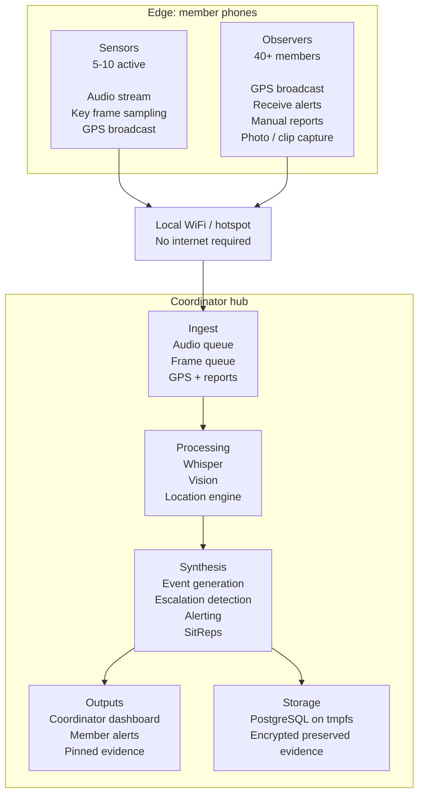

# Osk

Local-first situational awareness for civilian groups.

Osk is a design-stage project for a hub-and-spoke system that helps groups
coordinate during protests, public meetings, large events, travel, and other
situations where shared awareness matters.

> Status: Osk is currently a public design-and-foundation repository. The repo
> contains specs, plans, governance documents, and a working Phase 1 host/runtime
> baseline for local install, start/stop, operator sessions, audit, logs, and
> member visibility. Phase 2 now also includes a hub-owned intelligence service
> with config-selectable fake or real transcript/vision adapters, but live
> member ingest, synthesis, the dashboard, and the mobile client are still
> planned.

## At a Glance

- **Local-first**: the planned system runs on coordinator-managed hardware
  without requiring cloud APIs
- **Browser-based**: members are intended to join from a mobile browser rather
  than an app-store install
- **Role-based**: one coordinator manages the hub; sensors and observers get
  different capabilities and alert levels
- **Privacy-focused**: the planned storage model is ephemeral by default, with
  selective preservation to encrypted storage
- **Publicly designed**: architecture, tradeoffs, and implementation phases are
  documented in the open as the system evolves

## Why Osk Exists

When a group is moving through a protest, rally, hearing, festival, or an
unfamiliar area, situational awareness is uneven. People know what they can see
and hear directly, but not what is unfolding a block away, which route just
changed, or whether the overall situation is escalating.

Osk is intended to close that gap with a local-first coordination model:
member phones act as lightweight edge clients, a coordinator laptop acts as the
hub, and the system synthesizes audio, location, manual reports, and key visual
signals into alerts and situation reports.

## What This Repository Contains

Right now, this repo is best understood as the public groundwork for the
project:

- [Design specification](docs/specs/2026-03-21-osk-design.md): architecture,
  data model, API contract, privacy model, and operating assumptions
- [Implementation plans](docs/plans/): phased build plans for the first working
  version
- Foundational host runtime under `src/osk/`: config, migrations, hub lifecycle,
  operator bootstrap/session flow, local audit/log/member observability, and
  early REST/WebSocket wiring
- [Security policy](SECURITY.md): how to report sensitive issues
- [Safety and use limits](SAFETY.md): non-guarantees, trust boundaries, and
  misuse concerns
- [Contributing guide](CONTRIBUTING.md): how to contribute while the repo is
  still design-first
- [Agent rules](AGENTS.md): project invariants and expectations for AI-driven
  implementation work
- [Workflow guide](docs/WORKFLOW.md): recommended solo-maintainer plus
  AI-agent execution loop
- [Provenance record](docs/PROVENANCE.md): how spin-off and future code reuse
  are tracked

If you are looking for the full intelligence platform described in the plans,
it has not landed yet.

## Current Foundation

What exists today:

- Local hub lifecycle commands: `osk install`, `osk start`, `osk status`, and
  `osk stop`
- Local operator flow: `osk operator login`, `osk operator status`, and
  `osk operator logout`
- Local observability commands: `osk audit`, `osk logs`, and `osk members`
- Database migrations, coordinator auth boundary, member reconnect handling,
  and heartbeat-based stale-session cleanup
- Early REST/WebSocket hub surface for the coordinator and member join/runtime
  flow
- Hub-owned Phase 2 intelligence service: shared ingest/result models,
  config-selectable fake or real transcript/vision adapters, bounded
  audio/frame ingest queues, background audio/vision worker loops, and an
  admin-visible runtime status surface

What is still missing:

- Live member audio/frame ingestion into the running hub
- Observation persistence and synthesis-driven event generation
- Event synthesis and sitrep generation
- Coordinator dashboard and mobile PWA user experience
- Validated wipe timing and production-grade evidence/export tooling

## Planned Operating Model

In the current design:

- A **coordinator** runs the hub on a Linux laptop
- **Sensors** stream audio and selected visual signals for local processing
- **Observers** share location, receive alerts, and submit manual reports
- The **hub** fuses those inputs into alerts, events, and periodic situation
  reports
- Members receive **role-appropriate output** rather than the full picture

## Design Principles

- **Local-first by default**: no required cloud dependency in the baseline
  design
- **Ephemeral by default**: operational data should be treated as temporary
  unless explicitly preserved
- **Low-friction participation**: joining should work from a QR code and a
  mobile browser
- **Tiered roles**: not every participant should generate the same ingest load
- **Actionable output**: members should receive filtered alerts, not raw noise
- **Public reasoning**: design choices, risks, and tradeoffs should be visible
  in the repository

## Planned Capabilities

| Area | Intended Behavior |
|---|---|
| **Audio intelligence** | Sensors stream audio to the hub for local transcription and event detection |
| **Edge vision** | Phones send key frames rather than continuous video, reducing bandwidth and processing load |
| **Location awareness** | Member GPS updates support clustering, proximity alerts, and map-based coordination |
| **Situation reports** | The coordinator receives periodic summaries and trend signals |
| **Selective preservation** | Important events can be pinned for encrypted preservation while the rest remains ephemeral |
| **Emergency controls** | The design includes a fast wipe path, but it is not implemented or validated in this repo yet |

## Intended Use Cases

- **Protests and marches**: route changes, police movement, blocked exits, and
  escalation signals
- **Public meetings and hearings**: group coordination in contentious spaces
- **Large events**: conferences, festivals, rallies, and other dense crowds
- **Travel**: groups moving through unfamiliar environments
- **Community safety**: local coordination beyond ad hoc group chats

## Roadmap

The initial implementation is split into six phases:

| Phase | Scope | Status |
|---|---|---|
| [1. Core Hub + Connection](docs/plans/2026-03-21-plan-1-core-hub-connection.md) | Scaffolding, models, DB, auth, server, CLI | Foundational runtime in repo |
| [2. Intelligence Pipeline](docs/plans/2026-03-21-plan-2-intelligence-pipeline.md) | Whisper, vision, ingest queues, location engine | Contracts + workers + runtime adapters in repo |
| [3. Synthesis Layer](docs/plans/2026-03-21-plan-3-synthesis-layer.md) | Events, alerts, SitReps | Planned |
| [4. Coordinator Dashboard](docs/plans/2026-03-21-plan-4-coordinator-dashboard.md) | Map, timeline, sensor management | Planned |
| [5. Mobile PWA](docs/plans/2026-03-21-plan-5-mobile-pwa.md) | Join flow, alert feed, edge sampling | Planned |
| [6. Operations Tooling](docs/plans/2026-03-21-plan-6-operations-tooling.md) | Hotspot, evidence, tile caching | Planned |

See the [design specification](docs/specs/2026-03-21-osk-design.md) for the
full architecture, API contract, and threat-model assumptions.

## What You Can Do Right Now

- Read the [design specification](docs/specs/2026-03-21-osk-design.md)
- Review the [implementation plans](docs/plans/)
- Run `PYTHONPATH=src python -m osk doctor --json` locally, or `osk doctor --json`
  after installing the package
- Use `osk status`, `osk operator status`, `osk audit`, `osk members`, and
  `osk logs` to inspect the local foundation runtime
- Configure `transcriber_backend` / `vision_backend` in `~/.config/osk/config.toml`
  if you want the hub-owned intelligence service to use real Whisper or Ollama
  adapters instead of the default fake backends
- Open a `Design feedback` issue if you see a gap or bad assumption
- Open a `Bug report` issue for contradictions, broken links, or repo problems
- Use Discussions for broader proposals and open-ended questions

## Hardware Assumptions

The current design assumes a Linux-based coordinator machine with:

- NVIDIA GPU with CUDA support
- 16 GB RAM minimum, 32 GB recommended
- WiFi hardware capable of AP mode
- Enough local storage for models and encrypted preserved evidence

These are design assumptions for the planned first implementation, not tested
runtime requirements for a released build.

## Security and Safety

Osk is being designed for environments where data compromise can have serious
consequences. The privacy and security model in this repo describes intended
properties, not verified guarantees.

Key design goals:

- **Ephemeral-by-default operation**
- **Selective encrypted preservation**
- **No persistent account system in the baseline join model**
- **Local-network encrypted transport**
- **No required cloud dependency**

Read [SECURITY.md](SECURITY.md) for responsible disclosure and
[SAFETY.md](SAFETY.md) for current limitations, non-guarantees, and misuse
boundaries.

## Contributing

Contributions are welcome, especially around documentation quality, threat
modeling, design review, and repo hygiene while the implementation is still
forming.

Start with [CONTRIBUTING.md](CONTRIBUTING.md). This project also follows the
[Code of Conduct](CODE_OF_CONDUCT.md).

## License

Osk is licensed under the [GNU Affero General Public License v3.0 only](LICENSE)
(`AGPL-3.0-only`).

That choice is deliberate: if Osk becomes a networked tool, the project and its
derivative deployments should remain open source.

See [NOTICE](NOTICE) for attribution guidance and [docs/PROVENANCE.md](docs/PROVENANCE.md)
for spin-off and code-reuse tracking.
