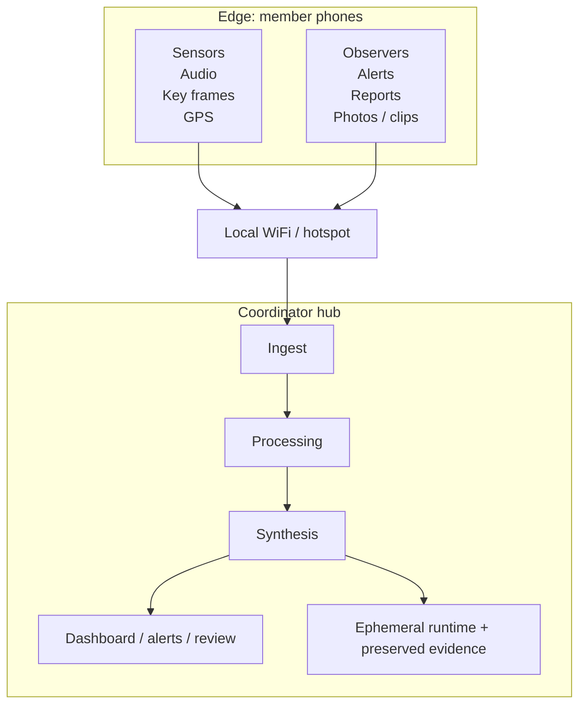

# Osk

Osk is a local-first coordination system for civilian groups operating in
dynamic public environments.

It is designed around one coordinator-run Linux laptop and browser-based
members joining over a local network. The hub collects member reports, location
updates, and bounded media/sensor input, then turns that into operator review
surfaces, alerts, and situation summaries.

> Status
> Osk is not a finished platform. This repository contains real implementation
> and real validation work, but it is still pre-release. The current focus is
> a narrow, truthful `1.0.0` for Linux coordinator hosts and Chromium-class
> member browsers only.

## What Osk Is

Osk is a repo for building and validating a bounded product slice:

- a coordinator-run local hub
- a browser-based member runtime
- a local operator review shell
- explicit evidence/export/wipe workflows
- a release process that is constrained by what the repo can actually prove

Osk is not this:

- a broad "works everywhere" mobile platform
- a claim of anonymity or endpoint safety
- a finished incident-command system
- a release with open-ended browser or device support

## Why It Exists

When a group is moving through a protest, hearing, rally, march, festival, or
other crowded environment, the problem is not just communication. The problem
is uneven awareness.

Different people see different things. Some have a useful view. Some are moving
through blocked routes. Some are hearing escalating activity before the rest of
the group does. Osk is meant to narrow that gap without assuming cloud
services, app-store installs, or a permanent account system.

The model is simple:

- one coordinator runs the hub on a Linux laptop
- members join from a browser
- the hub accepts bounded local inputs
- the coordinator gets a live review surface and explicit operator tooling

## Current Product Boundary

The repository has a lot of design material, but the intended launch boundary
is deliberately narrow. The authoritative release definition is in
[docs/release/1.0.0-definition.md](docs/release/1.0.0-definition.md).

### Supported for the current `1.0.0` target

| Area | Supported boundary |
| --- | --- |
| Coordinator host | One Linux laptop |
| Python baseline | CI-tested on Python 3.11, 3.12, and 3.13 |
| Member browser family | Chromium-class browsers only |
| Runtime shape | Local-first coordinator + browser member flow |
| Operations tooling | Install, preflight, status, dashboard, evidence export/verify, wipe readiness, wipe follow-up |

### Explicitly not supported as a launch claim

- Firefox support
- Safari or iOS support
- arbitrary browser/device compatibility
- broad disconnected-device wipe guarantees
- the full end-state dashboard/mobile experience described in the design spec

## What Exists Today

Osk already contains substantial implementation, not just plans.

### Coordinator and operator runtime

- `osk install`, `osk start`, `osk status`, `osk stop`
- `osk doctor --json` for scaffold/install/hotspot/runtime checks
- local operator session flow:
  `osk operator login|status|logout`
- local dashboard bootstrap via `osk dashboard`
- local observability and review commands:
  `osk audit`, `osk logs`, `osk members`, `osk findings`, `osk review`

### Member runtime

- browser-based join flow
- clean token exchange from `/join?token=...` into a cookie-backed session
- thin `/member` runtime shell
- live alerts, GPS sharing, manual notes
- reconnect-aware runtime state
- offline queueing and replay for supported manual flows
- early observer media and bounded sensor capture
- first installable/offline-capable PWA layer

### Intelligence and review

- live member ingest over the owned hub service boundary
- persisted observations, events, sitreps, and findings
- heuristic synthesis and corroboration
- coordinator finding triage and review actions
- live coordinator dashboard state and stream endpoints

### Operations tooling

- tile cache inspection and acquisition
- hotspot guidance and `nmcli`-based hotspot commands
- evidence unlock/export/verify/destroy flows
- install and wipe drill reports
- explicit coordinator wipe command plus wipe-follow-up tracking

## Fastest Way In

If you want to understand the repo quickly, read in this order:

1. [docs/release/1.0.0-definition.md](docs/release/1.0.0-definition.md)
2. [docs/release/1.0.0-blockers.md](docs/release/1.0.0-blockers.md)
3. [docs/specs/2026-03-21-osk-design.md](docs/specs/2026-03-21-osk-design.md)
4. [docs/runbooks/release-validation.md](docs/runbooks/release-validation.md)
5. [CONTRIBUTING.md](CONTRIBUTING.md)

If you want to run or inspect the implementation quickly:

```bash
make install-dev
pre-commit install
osk doctor --json
osk drill install
```

## Quickstart

### Prerequisites

For local development:

- Python 3.11, 3.12, or 3.13
- a POSIX shell environment
- a Compose-compatible local runtime if you want the default service mode
- optional: `ffmpeg` for the real Whisper path
- optional: `NetworkManager` / `nmcli` for repo-owned hotspot commands

### Development Setup

Standard contributor baseline:

```bash
make install-dev
pre-commit install
make check
```

If you also need the real intelligence adapters:

```bash
make install-all
pre-commit install
make check
```

### First Local Inspection

```bash
osk doctor --json
osk drill install
osk operator login
```

That gives you:

- scaffold and install readiness
- hotspot and `join_host` guidance
- operator session state for local runtime work

### Runtime Bring-Up

```bash
osk start "Local Validation"
osk status --json
osk dashboard
```

Use `osk dashboard` to print the local dashboard URL and one-time unlock code.

### Evidence and wipe flows

```bash
osk evidence export --output osk-evidence-export.zip
osk evidence verify --input osk-evidence-export.zip
osk drill wipe --export-bundle osk-evidence-export.zip
```

### Member shell smoke path

For a disposable real-browser target outside the main hub:

```bash
PYTHONPATH=src python scripts/member_shell_smoke.py --host 0.0.0.0 --advertise-host <lan-ip>
```

For the browser-driven smoke helper when localhost is reachable:

```bash
scripts/member_shell_playwright_smoke.sh --headed
```

## Core Commands

| Command | Purpose |
| --- | --- |
| `osk version` | Print package version |
| `osk doctor --json` | Show repo/install/runtime preflight status |
| `osk install` | Install local runtime assets |
| `osk start "<name>"` | Start or resume an operation |
| `osk status --json` | Show runtime state and wipe readiness |
| `osk stop` | Stop the current operation |
| `osk operator login` | Establish local operator session |
| `osk dashboard` | Print local dashboard URL and one-time code |
| `osk audit` | Inspect recent audit activity |
| `osk members` | Show current members and wipe-readiness summary |
| `osk findings` / `osk review` | Inspect synthesized review surfaces |
| `osk finding ...` | Triage one finding |
| `osk tiles status|cache` | Inspect or populate cached map tiles |
| `osk hotspot status|up|down|instructions` | Inspect or manage hotspot setup |
| `osk evidence unlock|export|verify|destroy` | Manage preserved evidence |
| `osk drill install|wipe` | Run read-only operator drills |
| `osk wipe --yes` | Broadcast wipe to connected members and stop the hub |

## Architecture



### Working model

- the coordinator host owns the runtime and operator workflows
- members join from a browser instead of a native app
- ingest is bounded and local-first
- synthesized output is reviewed rather than treated as unquestionable truth
- evidence/export/wipe are explicit operator actions, not hidden background
  behavior

## Repository Map

| Path | What it contains |
| --- | --- |
| [`src/osk/`](/var/home/bazzite/osk/src/osk) | Python package, CLI, hub logic, services, templates, static assets |
| [`tests/`](/var/home/bazzite/osk/tests) | Unit and integration coverage for current behavior |
| [`scripts/`](/var/home/bazzite/osk/scripts) | Real-browser and lab validation helpers |
| [`docs/specs/`](/var/home/bazzite/osk/docs/specs) | High-level design specification |
| [`docs/plans/`](/var/home/bazzite/osk/docs/plans) | Phase-by-phase implementation plans |
| [`docs/release/`](/var/home/bazzite/osk/docs/release) | Release definition, blockers, validation matrix, retained evidence notes |
| [`docs/runbooks/`](/var/home/bazzite/osk/docs/runbooks) | Validation, drills, and operations procedures |

## Release and Validation

The current repo is best understood as a build-and-validation base for a
truthful first release.

Key release documents:

- [1.0.0 release definition](docs/release/1.0.0-definition.md)
- [1.0.0 blockers](docs/release/1.0.0-blockers.md)
- [1.0.0 validation matrix](docs/release/1.0.0-validation-matrix.md)
- [release validation runbook](docs/runbooks/release-validation.md)

Recent retained validation evidence is also checked into
[`docs/release/`](/var/home/bazzite/osk/docs/release) so launch claims can be
traced back to actual runs.

## Development Workflow

The repository expects a disciplined, reviewable workflow rather than large,
multi-concern dumps.

- use small branches and coherent diffs
- run `make check` before pushing
- keep docs truthful when behavior changes
- do not expand support claims without validation evidence
- treat provenance and safety wording as part of the feature, not cleanup

See:

- [CONTRIBUTING.md](CONTRIBUTING.md)
- [docs/WORKFLOW.md](docs/WORKFLOW.md)
- [docs/runbooks/repo-maintenance.md](docs/runbooks/repo-maintenance.md)

## Dashboard Audit Workflow

Use the coordinator dashboard Audit Trail when you need to move from an audit
event back into the object it changed without reconstructing context by hand.

1. Start with the filter chip that matches the operator question:
   `Wipe follow-up` for cleanup-boundary verification, `Operator auth` for
   local session activity, or `Finding triage` for status and note changes.
2. Click a wipe follow-up audit row to open the member-specific detail view in
   the main pane. That view can show either the active follow-up record or a
   historical-only record where `follow_up` is `null` but the verification
   trail still remains available for review.
3. Click a finding-triage audit row to open the linked finding detail in the
   same main pane. Once open, the normal finding actions and note form still
   apply there; audit selection is a navigation path, not a read-only fork.
4. Use `Copy CLI` when you need the shell equivalent of the currently visible
   audit slice. The copied `osk audit` command should mirror the active
   dashboard filter so browser review and terminal verification stay aligned.

## Safety and Security

Osk is aimed at environments where privacy mistakes and false confidence can
cause real harm. The repository should be read with that in mind.

Important boundaries:

- Osk does **not** claim anonymity
- Osk does **not** claim protection against a compromised coordinator or member
  device
- Osk does **not** claim perfect deletion from browsers, operating systems, or
  hardware
- Osk does **not** claim broad browser support beyond the validated release
  boundary

Read these before making operational claims:

- [SAFETY.md](SAFETY.md)
- [SECURITY.md](SECURITY.md)

## Contributing

Contributions are welcome, but the most useful work right now is not random
feature growth. The highest-value work is:

- release-truthfulness fixes
- real browser/device validation
- runtime hardening
- operator workflow hardening
- documentation that tightens the gap between repo claims and repo evidence

Start here:

- [CONTRIBUTING.md](CONTRIBUTING.md)
- [docs/release/1.0.0-blockers.md](docs/release/1.0.0-blockers.md)
- [docs/runbooks/release-validation.md](docs/runbooks/release-validation.md)

## License

Osk is licensed under the terms in [LICENSE](LICENSE).
